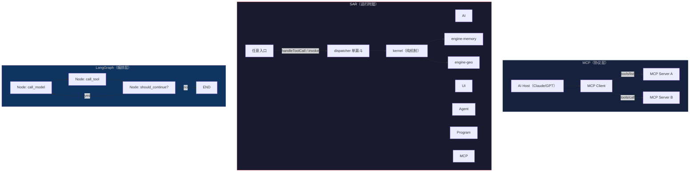
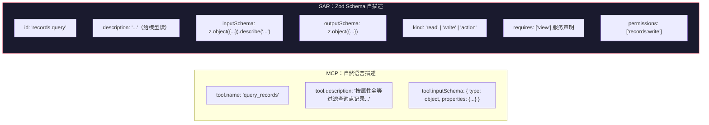
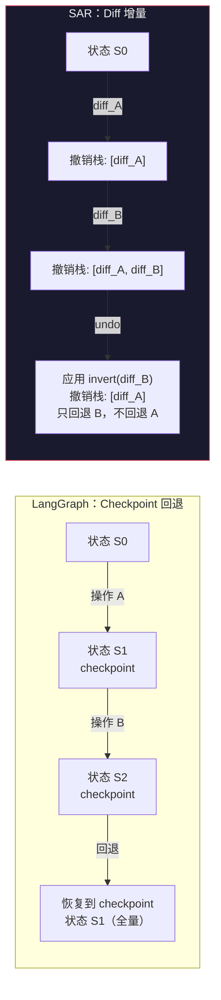
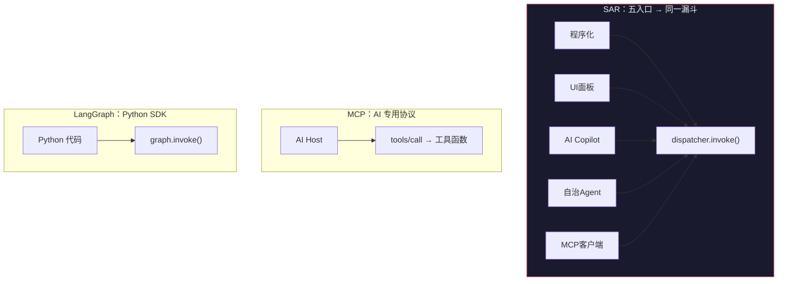
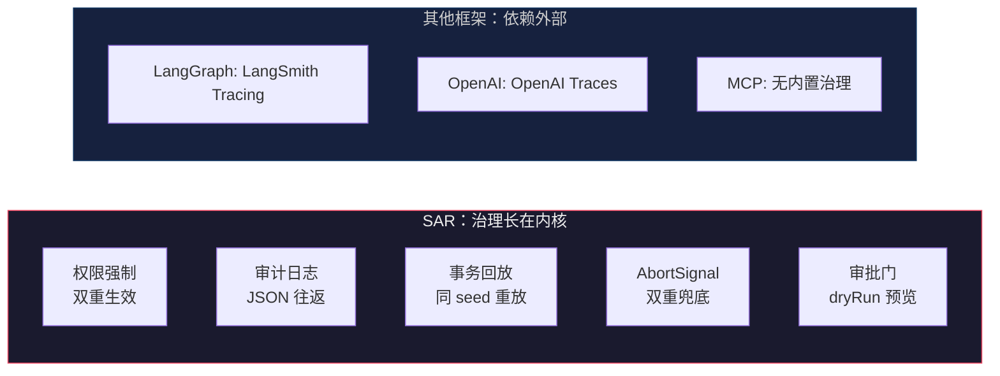
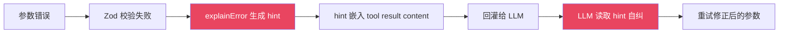
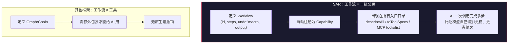
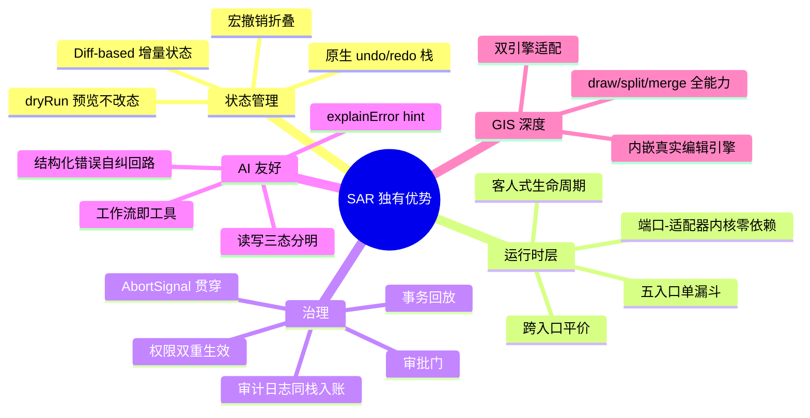

# SAR vs 主流框架对比分析

> 调研日期：2026-07-07 · 对比对象：MCP / LangGraph / OpenAI Agents SDK / Semantic Kernel / A2A

---

## 一、对比对象速览

| 框架 | 作者 | 定位 | 核心机制 |
|------|------|------|----------|
| **MCP** | Anthropic | AI↔工具通信协议 | JSON-RPC 2.0 协议，tools/list + tools/call |
| **LangGraph** | LangChain | 有状态 Agent 工作流编排 | 有向图节点 + Checkpoint 持久化 |
| **OpenAI Agents SDK** | OpenAI | 轻量 Agent 开发 | Agent + Runner + Handoffs + Guardrails |
| **Semantic Kernel** | Microsoft | 企业级 Agent 编排 | Plugins + Kernel + Planner（C#/Python） |
| **A2A** | Google | Agent 间通信协议 | Agent Card 发现 + Task 生命周期 |
| **SAR** | DIY_Liu | 端口-适配器式 AI-native 空间运行时 | 三原语 Capability/Command/Workflow + 单漏斗 |

---

## 二、架构对比全景



**关键差异**：MCP 在"协议层"解决工具发现和调用；LangGraph 在"编排层"解决工作流控制；SAR 在"运行时层"——同时解决工具定义、状态管理、撤销、治理、多入口。

---

## 三、逐维度对比

### 3.1 工具定义与自描述



| MCP | SAR |
|-----|-----|
| 工具描述靠自然语言字符串 | Zod schema → JSON Schema 同源投影，一份定义供 UI/AI/MCP |
| 无运行时出参校验 | handler 出参也过 `outputSchema`，描述符即承诺 |
| 无法区分读写（全靠描述暗示） | `kind: read/write/action` 三态，权限/审批门/干跑全依赖此区分 |
| 无服务依赖声明 | `requires` 前置校验，缺失报 `service_missing` 而非 handler 深处裸错 |
| 学术研究发现工具描述"有味道" | doctor 自动检查 description 质量（≥15字）/ id 合法性 / 双射冲突 |

> 📄 参考：[MCP Tool Descriptions Are Smelly! (arXiv 2025)](https://arxiv.org/html/2602.14878v1) 指出 MCP 工具描述缺乏结构化质量保障。

---

### 3.2 状态管理与撤销

这是 **SAR 与所有对比框架最根本的区别**。

| 框架 | 状态模型 | 撤销机制 |
|------|----------|----------|
| **MCP** | 无（工具自行管理状态，协议不管） | 无 |
| **LangGraph** | Checkpoint（全量快照序列化） | 靠 checkpoint 回退（全量恢复，非增量） |
| **OpenAI Agents SDK** | 无统一抽象 | 无 |
| **Semantic Kernel** | 无统一抽象 | 无 |
| **SAR** | **Diff-based**：每个写操作产生精确 diff | **原生 undo/redo**：引擎内建撤销栈 + DiffAlgebra  |



**SAR 的优势**：
- Diff 是**增量的**：undo 只回退最后一步，不影响前面的操作
- Diff 可**合并**：工作流多写步经 DiffAlgebra.merge 折叠成一个撤销单元（宏撤销）
- Diff 可**预览**：dryRun 不改状态就拿到 "将发生什么"
- algebra 带**属性律测试**：invert 复原律 + merge 等价律由 fast-check 钉死

---

### 3.3 宏撤销（SAR 独有）

MCP、LangGraph、OpenAI SDK 都没有等价物。

```mermaid
sequenceDiagram
    participant W as Workflow
    participant T as TransactionGroup
    participant A as DiffAlgebra

    rect rgb(233, 69, 96)
        Note over W,A: SAR：宏撤销
        W->>T: 步1: highlight（diff_A）
        W->>T: 步2: nudge（diff_B）
        W->>A: merge(diff_A, diff_B)
        A-->>T: 单一 diff_merged
        Note right of T: undoDepth +1<br/>一次 undo 全回退
    end
    
    rect rgb(15, 52, 96)
        Note over W,A: 其他框架：每步独立
        W->>W: 步1 → undoDepth +1
        W->>W: 步2 → undoDepth +1
        Note right of W: 需要 2 次 undo<br/>或无 undo
    end
```



**为什么重要**：AI 调用一个 "高亮并平移" 工作流后，用户一次 undo 就能全回退——这在其他框架中需要用户手动 undo 两次，或根本不支持。

---

### 3.4 多入口 vs 单入口



| 框架 | 入口数 | 跨入口一致性 |
|------|--------|-------------|
| MCP | 1（AI） | N/A |
| LangGraph | 1（代码） | N/A |
| OpenAI SDK | 1（代码） | N/A |
| Semantic Kernel | 1（代码） | N/A |
| **SAR** | **5** | **测试钉死：同参数 → 同 diff → 同引擎终态** |

---

### 3.5 治理体系



| 治理能力 | MCP | LangGraph | OpenAI SDK | SK | SAR |
|----------|-----|-----------|------------|-----|-----|
| 权限控制 | ❌ | ❌（应用层自己做） | Guardrails（仅输入输出） | ❌ | ✅ 白名单双重生效 |
| 审计日志 | ❌ | Tracing（外部平台） | Tracing（外部平台） | ❌ | ✅ 中间件入账，JSON 往返持久化 |
| 操作回放 | ❌ | Checkpoint 重放 | ❌ | ❌ | ✅ Journal 录制 → 同 seed 重放 |
| 中止信号 | ❌ | ❌ | ❌ | ❌ | ✅ AbortSignal handler 前+写路由前双重检查 |
| 人审门 | ❌ | ❌ | ❌ | ❌ | ✅ 写动作 dryRun 预览 → approve |
| **全入口统一治理** | ❌ | ❌ | ❌ | ❌ | ✅ 任何入口自动同栈治理 |

---

### 3.6 错误自纠回路



| 框架 | 错误反馈质量 |
|------|-------------|
| MCP | 自然语言 error 字符串（质量依赖工具开发者） |
| LangGraph | Python Exception → 需手动处理 |
| OpenAI SDK | function call error → 模型可能原地重试相同参数 |
| **SAR** | 结构化 issues + 可操作 hint + 相似能力建议 → 模型**真正能自纠** |

---

### 3.7 工作流即工具

SAR 的 Workflow 注册后**自动成为能力**，出现在所有入口的目录里。其他框架中工作流是编排层概念，不暴露给 AI 做工具。



---

### 3.8 领域深度（GIS）

| 框架 | GIS 支持 |
|------|----------|
| MCP | 泛用工具封装（无 GIS 原生能力） |
| LangGraph | 泛用编排（无 GIS 原生能力） |
| SAR | **内嵌 GeoVerse 真实编辑引擎**：editor-core EditEngine 零阻抗接入，引擎层零改动；capabilities-geo 提供 draw/split/merge/zoom/setBase 全能力面 |

---

## 四、核心差异化优势总结



---

## 五、定位对比：SAR 的生态位

```
        协议层                    编排层                     运行时层
    ┌──────────┐           ┌──────────────┐          ┌──────────────────┐
    │   MCP    │           │  LangGraph    │          │       SAR        │
    │ 工具发现  │           │  工作流编排   │          │  能力注册+状态管理 │
    │ 工具调用  │           │  Checkpoint   │          │  撤销+治理+多入口  │
    └──────────┘           └──────────────┘          └──────────────────┘
         │                        │                           │
         ▼                        ▼                           ▼
    AI ↔ 工具通信            Agent 工作流控制            应用运行时（工具+状态+治理）
    （MCP 不管工具内部）      （LangGraph 不管工具内部）    （SAR 管工具的全部生命周期）
```

**SAR 的生态位是 MCP 和 LangGraph 都没覆盖的**：
- MCP 解决"AI 怎么调用工具"（协议层），SAR 解决"工具内部怎么管理状态、撤销、治理"（运行时层）
- LangGraph 解决"有状态工作流怎么编排"（编排层），SAR 解决"编排好的工作流怎么让 AI/UI/Agent 共享同一运行时"
- **SAR + MCP 互补**：SAR 作为 MCP server 的运行时内核，MCP 暴露工具给外部
- **SAR 可替代 LangGraph 的编排层**：Workflow 引擎 + 宏撤销 + 工作流即工具，不需要额外图编排

---

## 六、有待完善的差距

客观来看，SAR 与成熟框架相比也有差距：

| 维度 | 成熟框架 | SAR 现状 |
|------|----------|----------|
| 生态/社区 | MCP: 数百官方 server；LangGraph: 大规模生产部署 | 单人项目 |
| 多语言 | MCP: Python/TS/Java/Kotlin/C# | TypeScript only |
| 持久化 | LangGraph: Postgres/SQLite checkpoint | 内存引擎（持久化待做） |
| 流式支持 | OpenAI SDK / LangGraph: 原生 streaming | Planner 层有流式 |
| 文档成熟度 | MCP/LangGraph: 完整文档站 + 教程 | docs D0 完成，D1/D2 待做 |
| Agent 空间观察 | N/A | 当前 Observation 信息面有限（缺地图上下文） |
